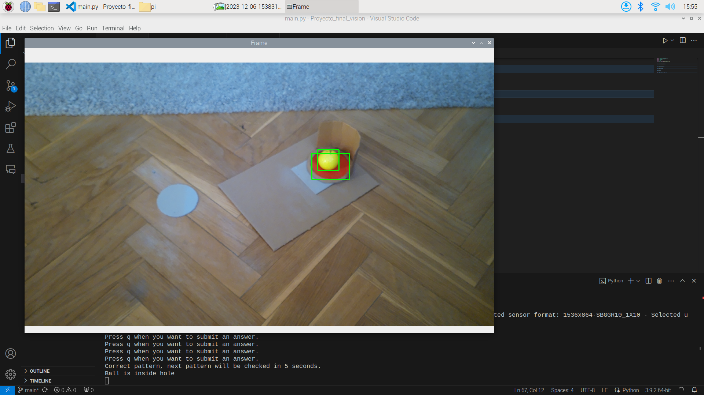

# Proyecto Final de Visión por Ordenador I

## Integrantes:
- Alejandro Martínez de Guinea García
- Javier Prieto Domínguez

## Descripción del proyecto:
El objetivo de este proyecto es el de desarrollar un sistema de seguimiento de una pelota de golf y comprobar si entra en el agujero. Previo a eso, el sistema tiene que ser activado con una serie de patrones ordenados que se mostrarán a la cámara posterior a su calibración. Una vez activado, el sistema seguirá la pelota y comprobará si entra en el agujero.




## Descripción de los ficheros:
- **main.py**: Fichero principal del proyecto. En él se encuentra el bucle principal del programa, que se encarga de leer los frames de la cámara, procesarlos y mostrarlos por pantalla. Si estás conectado a la Raspberry Pi con la cámara conectada, solo se deberá ejecutar este fichero para que el programa funcione.

- **calibration.py**: Fichero que contiene funciones relacionadas con la calibración de la cámara.

- **pattern_detection.py**: Fichero que contiene funciones para la detección de patrones.

- **tracker.py**: Fichero que contiene funciones para la detección de la pelota, del agujero y de si está dentro o no.

## Instalación:
Para instalar el proyecto, se deberá clonar el repositorio en la Raspberry Pi con la cámara conectada.

Si no tiene la Raspberry Pi configurada, deberá seguir los siguientes pasos:


Una vez hecho esto, se deberán instalar las librerías necesarias. Para ello, se deberá ejecutar el siguiente comando en la terminal:
```
pip install -r requirements.txt
```

## Ejecución:
Una vez hecho esto, se deberá ejecutar el fichero main.py con Python 3.7 o superior. Para ello, se deberá ejecutar el siguiente comando en la terminal:

```
python main.py
```

Como se ha mencionado anteriormente, se necesitarán imágenes de los patrones para que el programa funcione. Esas imágenes se encuentran en la carpeta ```patterns_images``` y se deberán seguir las intrucciones que aparecen en pantalla para activar el sistema de seguimiento.


